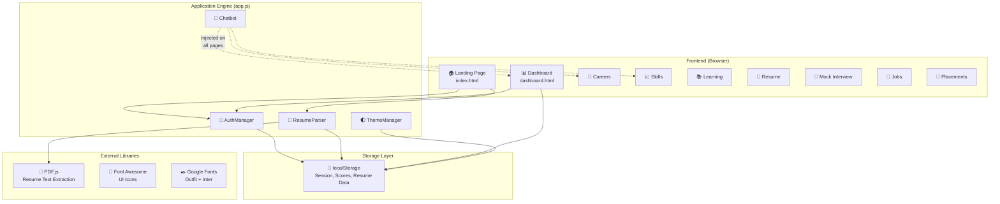

<div align="center">

# 🧠 CareerInfinity AI

### *Your AI-Powered Career Intelligence Platform*

[](https://infyspringboard.onwingspan.com)
[](https://github.com/drishiyam/AI_Career_Infinity)
[](LICENSE)
[](https://developer.mozilla.org/en-US/docs/Web/HTML)
[](https://developer.mozilla.org/en-US/docs/Web/CSS)
[](https://developer.mozilla.org/en-US/docs/Web/JavaScript)

<br/>

**CareerInfinity AI** is a comprehensive, AI-driven career intelligence platform built for the **Infosys Springboard Internship Program 2026**. Upload your resume and let our intelligent engine extract skills, compute career match scores, recommend placement drives, and guide you through personalized learning paths — all powered by client-side AI analysis.

<br/>

[🚀 Get Started](#-quick-start) · [✨ Features](#-features) · [📸 Screenshots](#-screenshots) · [🏗️ Architecture](#%EF%B8%8F-architecture) · [🤝 Contributing](#-contributing)

---

</div>

<br/>

## 🌟 Highlights

<table>
<tr>
<td width="50%">

### 🎯 What It Does
- **Parses your resume** in real-time using client-side AI (PDF, DOCX, TXT)
- **Calculates a Career Match Score** based on skills, certifications, and projects
- **Recommends career paths** (Data Scientist, Full Stack Developer, DevOps Engineer, etc.)
- **Provides ATS readiness scoring** with keyword optimization tips
- **Simulates mock interviews** with AI-generated Q&A across multiple domains
- **Tracks learning progress** with structured modules and certifications

</td>
<td width="50%">

### ⚡ Why It Stands Out
- 🏎️ **Zero server dependencies** — runs entirely in the browser
- 🌓 **Dark & Light mode** with persistent theme switching
- 🔐 **SSO gateway simulation** (Google, LinkedIn, Microsoft)
- 🤖 **Universal AI chatbot** available on every page
- 📱 **Fully responsive** — optimized for desktop, tablet, and mobile
- 🎨 **Premium glassmorphic UI** with smooth micro-animations

</td>
</tr>
</table>

<br/>

## ✨ Features

### 🏠 Landing Page & Onboarding
> Multi-step onboarding flow with live name preview, resume drag-and-drop, and SSO authentication

- **3-Step Guided Onboarding** — Name entry → Resume upload → Dashboard access
- **Live Name Preview Badge** — Real-time greeting with initials avatar as you type
- **SSO Single Sign-On Gateway** — Interactive modal with Google, LinkedIn, and Microsoft provider simulation
- **Persistent Session Detection** — Automatically recognizes returning users via localStorage
- **Hero Statistics** — Dynamic metrics showcasing platform capabilities (50K+ Interns, 92% Accuracy, 30s Analysis)

---

### 📊 AI-Powered Dashboard
> Central command center displaying all career metrics at a glance

- **Career Match Score** — Weighted percentage combining skills, certifications, projects, and experience
- **Profile Strength Meter** — Visual gauge of profile completeness
- **Top Career Paths** — AI-inferred job recommendations ranked by match percentage
- **Skills Learned Counter** — Aggregated count from resume parsing
- **Quick Action Cards** — One-click access to key platform sections
- **Re-upload Resume** — Update your data anytime with instant dashboard refresh

---

### 🎯 Career Intelligence
> Deep analysis of career paths with domain-specific recommendations

- **Domain Selection Grid** — Explore career paths across Data Science, Web Development, Cloud/DevOps, Java Enterprise, and more
- **Match Percentage Visualization** — Animated progress bars for each recommended role
- **Skill Gap Identification** — Highlights which skills to add for higher match scores

---

### 📈 Skill Analysis
> Comprehensive breakdown of your technical proficiency

- **10+ Skill Categories** — Python, JavaScript, Java, SQL, Machine Learning, Cloud/DevOps, Data Structures, C/C++, Data Science, and Web Development
- **Keyword-Based Scoring** — Scans resume text against curated keyword databases per skill
- **Proficiency Levels** — Each skill scored 0-100% based on keyword hit density

---

### 📚 Learning Path
> Structured modules to bridge skill gaps and boost career readiness

- **Interactive Learning Modules** — Topic breakdowns with expandable details
- **Progress Tracking** — Mark lessons complete, unlock next modules
- **Study Notes Viewer** — In-app reference material for each module
- **Module Quizzes** — Retake assessments to solidify knowledge
- **Certificate Generation** — Temporary certificates upon module completion

---

### 📄 Resume Analyzer
> In-depth resume quality assessment with actionable improvements

| Metric | Description |
|--------|-------------|
| **ATS Score** | Applicant Tracking System compatibility rating |
| **Grammar Score** | Document clarity and language assessment |
| **Keyword Score** | Technical keyword coverage analysis |
| **Formatting Score** | Structure and layout quality rating |
| **AI Comment** | Personalized feedback based on overall analysis |

---

### 🎤 Mock Interview Simulator
> Practice interviews with AI-generated questions across technical domains

- **Multi-Domain Coverage** — Data Structures, DBMS, Operating Systems, Networking, OOPs, and more
- **Difficulty Levels** — Questions range from foundational to advanced
- **Topic-by-Topic Breakdown** — Expandable question panels with detailed model answers
- **Review System** — Mark topics as reviewed and track interview readiness

---

### 💼 Job Recommendations
> Smart job matching based on your resume profile

- **Role-Skill Alignment** — Jobs filtered by your detected skill categories
- **Company Profiles** — Detailed listings with salary ranges, locations, and job types
- **Application Tracking** — Monitor job application status

---

### 🏢 Placement Drives
> Live and upcoming campus placement drive listings

- **Drive Listings** — Real-time drive information for major companies (TCS, Infosys, Wipro, etc.)
- **Eligibility Checker** — Match your profile against drive requirements
- **Registration System** — One-click application to placement drives

---

### ✅ Assessments & 🏆 Certificates
- **Technical Assessments** — Domain-specific quizzes with scoring
- **Certificate Gallery** — View, download, and share earned certificates
- **Ideas Lab** — Innovation showcase and project idea brainstorming

---

### 🤖 Universal AI Chatbot
> Context-aware assistant available on every page

- **Resume Score Queries** — Ask about your ATS score and get improvement tips
- **Career Path Guidance** — Get personalized career recommendations
- **Platform Help** — SSO login help, theme toggle info, data transparency
- **Suggestion Pills** — Quick-access prompts for common queries
- **Responsive Design** — Floating action button with expandable chat window

<br/>

## 🛠️ Tech Stack

<div align="center">

| Layer | Technology | Purpose |
|:---:|:---:|:---|
| **Structure** |  | Semantic markup with 11 interconnected pages |
| **Styling** |  | 2500+ lines — Complete design system with CSS custom properties, dark/light themes |
| **Logic** |  | 2000+ lines — Vanilla JS with modular architecture (ThemeManager, AuthManager, ResumeParser) |
| **PDF Parsing** |  | Mozilla PDF.js v3.11 for client-side resume text extraction |
| **Icons** |  | Font Awesome 6.5 for 100+ UI icons |
| **Fonts** |  | Outfit (headings) + Inter (body) for premium typography |
| **Dev Server** |  | Static file server for local development |

</div>

<br/>

## 📁 Project Structure

```
AI_Career_Infinity/
│
├── index.html              # 🏠 Landing page — Onboarding, SSO gateway, hero section
├── dashboard.html          # 📊 Main dashboard — Career metrics, match score, quick actions
├── careers.html            # 🎯 Career Intelligence — Domain exploration & path recommendations
├── skills.html             # 📈 Skill Analysis — Proficiency breakdown across 10+ categories
├── learning.html           # 📚 Learning Path — Structured modules, quizzes, progress tracking
├── resume.html             # 📄 Resume Analyzer — ATS score, keyword & formatting analysis
├── mockinterview.html      # 🎤 Mock Interview — Multi-domain Q&A with AI-generated questions
├── jobs.html               # 💼 Job Recommendations — Smart job matching & application tracking
├── placements.html         # 🏢 Placement Drives — Live campus drive listings & registration
├── assessments.html        # ✅ Assessments — Technical quizzes & evaluations
├── certificates.html       # 🏆 Certificates — Earned certificate gallery & sharing
├── ideas.html              # 💡 Ideas Lab — Innovation showcase & brainstorming
│
├── app.js                  # ⚙️  Application engine (2088 lines)
│                           #    ├── ThemeManager — Dark/light mode with localStorage persistence
│                           #    ├── AuthManager — Login state, user profiles, session management
│                           #    ├── ResumeParser — Client-side AI keyword extraction engine
│                           #    ├── Page Initializers — Dashboard, careers, skills, learning, etc.
│                           #    ├── Chatbot — Universal AI assistant injected on every page
│                           #    └── Utilities — Toast notifications, animations, helpers
│
├── style.css               # 🎨 Complete design system (2573 lines)
│                           #    ├── CSS Custom Properties — 35+ design tokens
│                           #    ├── Dark Theme — Deep navy/indigo palette
│                           #    ├── Light Theme — Clean, accessible colors
│                           #    ├── Component Styles — Cards, sidebar, forms, modals
│                           #    └── Animations — Micro-interactions & transitions
│
├── package.json            # 📦 Project manifest & dev scripts
└── README.md               # 📖 This file
```

<br/>

## 🚀 Quick Start

### Prerequisites

- **Node.js** (v16 or higher) — [Download here](https://nodejs.org/)
- A modern web browser (Chrome, Firefox, Edge, Safari)

### Installation

```bash
# 1. Clone the repository
git clone https://github.com/drishiyam/AI_Career_Infinity.git

# 2. Navigate to the project directory
cd AI_Career_Infinity

# 3. Install dependencies
npm install

# 4. Start the development server
npm run dev
```

The app will be available at **`http://localhost:3000`** (or the port shown in your terminal).

### Alternative: Direct Open

Since this is a purely static application, you can also simply open `index.html` directly in your browser — no server required!

<br/>

## 🏗️ Architecture



### Data Flow

```
📄 Resume Upload → 📑 PDF.js Extraction → 🤖 Keyword Matching Engine
                                                    ↓
                                          ┌─────────┴──────────┐
                                          │   10+ Skill DBs    │
                                          │   Cert Keywords     │
                                          │   Project Keywords  │
                                          │   Exp Keywords      │
                                          └─────────┬──────────┘
                                                    ↓
                                    ┌───────────────┼───────────────┐
                                    ↓               ↓               ↓
                              Match Score     ATS Score      Career Paths
                              (Weighted)    (Compatibility)  (AI Inferred)
                                    ↓               ↓               ↓
                                    └───────────────┼───────────────┘
                                                    ↓
                                            💾 localStorage
                                                    ↓
                                         📊 Dashboard Render
```

<br/>

## 🔧 How the AI Engine Works

The **ResumeParser** module performs intelligent client-side analysis:

### 1️⃣ Text Extraction
```
PDF file → PDF.js → Raw text content
DOCX/TXT → FileReader API → Raw text content
```

### 2️⃣ Skill Detection
Matches resume text against **10 curated skill databases**, each containing 8-10 industry keywords:

| Category | Sample Keywords |
|----------|----------------|
| Python | `python`, `django`, `flask`, `pandas`, `numpy`, `sklearn`, `fastapi` |
| JavaScript | `javascript`, `nodejs`, `reactjs`, `angular`, `typescript`, `nextjs` |
| Machine Learning | `machine learning`, `deep learning`, `tensorflow`, `pytorch`, `nlp` |
| Cloud & DevOps | `aws`, `azure`, `docker`, `kubernetes`, `terraform`, `ci/cd` |

### 3️⃣ Score Calculation

```
Match Score = (Average Skill Score × 0.40) +
              (Certification Score × 0.20) +
              (Project Score × 0.20) +
              (Profile Completeness × 0.20)
```

### 4️⃣ Career Path Inference
Based on detected skill combinations:
- **Python + ML + Data Science** → Data Scientist / ML Engineer
- **JavaScript + Web Dev** → Full Stack Developer
- **Java** → Backend / Enterprise Engineer
- **SQL + Data Science** → Data Analyst / BI Engineer
- **Cloud & DevOps** → Cloud / DevOps Engineer

<br/>

## 🌓 Theme System

CareerInfinity features a fully custom dual-theme system built with CSS Custom Properties:

| Property | Dark Mode | Light Mode |
|----------|-----------|------------|
| Background | `#070b1f` (Deep Navy) | `#f0f2f8` (Soft Gray) |
| Cards | `#0f1535` (Dark Indigo) | `#ffffff` (Pure White) |
| Text | `#e8edf8` (Soft White) | `#0a0f2c` (Dark Navy) |
| Accents | Purple/Emerald Gradients | Same Gradients |

Theme preference persists across sessions via `localStorage` and applies **before the first paint** to prevent flash of unstyled content.

<br/>

## 📸 Screenshots

> 💡 **To see the platform in action**, clone the repo and run `npm run dev`. The application features a rich, interactive UI with glassmorphic cards, animated progress bars, gradient accents, and smooth micro-animations that are best experienced live.

### Pages Overview

| Page | Description |
|------|-------------|
| **Landing Page** | Hero section with multi-step onboarding and SSO gateway |
| **Dashboard** | Central metrics hub with match score, career paths, and quick actions |
| **Career Intelligence** | Domain explorer with AI-recommended career paths |
| **Skill Analysis** | 10-category skill proficiency breakdown |
| **Learning Path** | Structured learning modules with progress tracking |
| **Resume Analyzer** | ATS, grammar, keyword, and formatting scores |
| **Mock Interview** | Multi-domain interview simulator with model answers |
| **Job Recommendations** | Smart job matching based on resume profile |
| **Placement Drives** | Campus drive listings and eligibility matching |

<br/>

## ⚠️ Important Notes

> **📋 Data Transparency:** This platform uses **client-side simulation** with `localStorage` and browser-based keyword extraction. No data leaves your browser. In a production environment, this would connect to:
> - REST API / GraphQL backend (Node.js + Express or Django)
> - Database (PostgreSQL, MongoDB) for persistent user profiles
> - AI microservice (Python/FastAPI with NLP) for advanced resume parsing
> - OAuth 2.0 server for real SSO with Google/Microsoft/LinkedIn

> **🔒 Privacy:** All resume data is processed entirely in your browser. Nothing is transmitted to any external server. Your resume content, scores, and personal information are stored only in your browser's `localStorage`.

<br/>

## 🤝 Contributing

Contributions are welcome! Here's how you can help:

1. **Fork** the repository
2. **Create** a feature branch:
   ```bash
   git checkout -b feature/amazing-feature
   ```
3. **Commit** your changes:
   ```bash
   git commit -m "feat: add amazing feature"
   ```
4. **Push** to the branch:
   ```bash
   git push origin feature/amazing-feature
   ```
5. **Open** a Pull Request

### Contribution Ideas

- [ ] Add real backend API integration (Node.js/Express or Python/FastAPI)
- [ ] Implement actual OAuth 2.0 SSO authentication
- [ ] Add resume export/download functionality
- [ ] Create unit tests for ResumeParser module
- [ ] Add more skill category databases
- [ ] Implement interview recording and playback
- [ ] Add multi-language support (i18n)
- [ ] Progressive Web App (PWA) support

<br/>

## 📄 License

This project is licensed under the **MIT License** — see the [LICENSE](LICENSE) file for details.

<br/>

---

<div align="center">

**Built with ❤️ for the Infosys Springboard Internship Program 2026**

*Empowering the next generation of engineering talent with AI-driven career intelligence*

<br/>

[](https://github.com/drishiyam/AI_Career_Infinity)
[](https://github.com/drishiyam/AI_Career_Infinity/fork)

</div>
